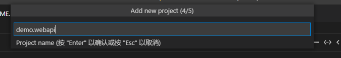
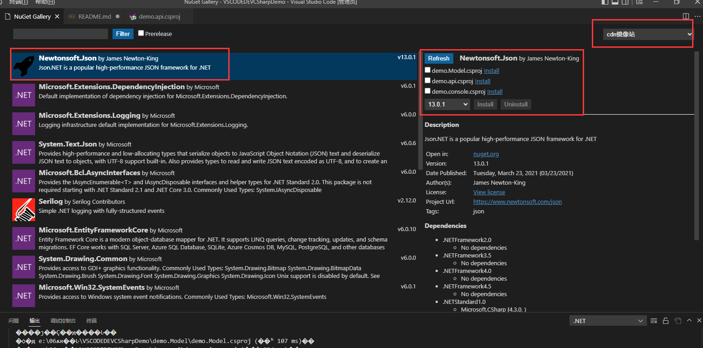

# 1. 开发前准备

## 1.1首先打开VScode 下载必要插件

1. C#  (官方C#插件)
2. C# Extensions (C#扩展插件)
3. NET Core Add Reference (填加引用插件)
4. Auto-Using for C# (自动引用命名空间插件)
5. C# XML Documentation Comments (cs 文件支持XML注释)
6. Add Local .Net Reference (项目中快速添加 .Net (netstandart) 程序集)
7. ASP.NET Core Switche (ASP.NET Core 切换器 用于MVC)
8. vscode-solution-explorer （VSCODE 解决方案插件）
9. vscode-icons （图标插件）
10. NuGet Gallery （NuGet 管理包工具）

 注意前提是需要下载NET SDk

## 1.2 插件设置

  目前只需要设置 NuGet Gallery


添加镜像站 不然需要科学上网

```json
{"name": "cdn镜像站","url": "https://nuget.cdn.azure.cn/v3/index.json"}


```

## 1.3 VsCode 快捷键设置

沿用VS的习惯 我这里修改了两个快捷键

### 触发建议 alt+ j


### 快速修复 alt+ 回车


# 2 开发教程

## 2.1 创建文件夹用VSCode打开并设置为工作区

## 2.2 使用解决方案插件创建解决方案


输入 VsCodedevdemo 回车


这样就创建好了解决方案

## 2.2 创建一个WEBAPI


右击解决方案选择新建一个项目  第一个选项是添加一个现有项目


选择的C#



输入项目名称 demo.webapi


这样就创建好了webapi

## 2.3 开启项目生成XML

[官网教程](https://learn.microsoft.com/zh-cn/aspnet/core/tutorials/getting-started-with-swashbuckle?view=aspnetcore-6.0&tabs=visual-studio-code#xml-comments)

在工程文件中添加XML配置

我们现在是demo.webapi.csproj 打开添加一下配置即可

```xml
<PropertyGroup>
  <GenerateDocumentationFile>true</GenerateDocumentationFile>
</PropertyGroup>
```

## 2.4 改在默认webapi 中的WeatherForecast.cs 将其提取到demo.Model类库中

注释掉demo.webapi中的WeatherForecast.cs文件中的内容

### 2.4.1 安装2.2中创建一个类库


将Class1.css 修改为WeatherForecast.cs 复制一下内容

## 2.5 给demo.api 添加项目引用

   右键demo.api.csproj 文件 选择 Add Reference 选择 demo.Model


还可以在解决方案中 Add Reference 。当只有两个项目时解决方案插件会自动引用另一个项目。因为这个自动引用原因 我用的少 就不演示了。可以自行实验


## 2.6 由于我们注释了demo.api中的类导致 api报红 修改一下Controller中的命名空间


alt + 回车


添加引用即可


# 3.运行与调试

首先打开demo.api 中的Program.cs （不打开也行个人习惯）F5 运行

## 3.1选择调试器


我们是net6 的sdk 选.net5 + and .net Core

然后会自动创建一个.vscode 的文件夹


这里是调试和运行环境 具体配置可以在VSCODE 官网查看里面详细属性是什么意思。这里我就不详细介绍了

[官网描述地址](https://github.com/OmniSharp/omnisharp-vscode/blob/master/debugger-launchjson.md)

如果没有自动创建这些 可以打开调试和运行页面


将会自动创建 然后F5运行即可

## 3.2 切换启动项目

 如果解决方案中有多个可以启动项目

需要删除.vscode文件夹

再次F5 运行调试


这个时候就可以选择你要启动的项目。会再次生成.vscode 文件夹

也可以修改launch.json 添加一个调试模式 name 具体参考3.1中的 链接

## 3.3 调试

和VS一样在对应的地方打上断点 F5运行即可 然后就是f10 f11往下走


# 4 nuget 管理包

Ctrl +shift +p  

输入 nuget

选择open nuget gallery


选择之前添加的镜像站 搜索你要的nuget包 选择相应的项目  install 即可



删除项目的nuget 包

推荐使用解决方案插件打开相应的项目 中的packages 点垃圾桶即可删除 或者手动编辑 csproj 


# 5.发布

  可以通过解决方案插件右键  publish 会在bin 下生成一个publish文件夹 这个发布是依赖框架的


如果你需要单文件发布 推荐是要用cli 的方式去发布 在控制台使用 net cli命令 这里官网很详细 就不详细描述了

[官网NET CLI 发布 文档](https://learn.microsoft.com/zh-cn/dotnet/core/deploying/deploy-with-cli)


# 6 注意事项 

1.如果在开发过程中出现了莫名其妙的问题。如命名空间 找不到什么的 可是使用C# 插件重启项目

Ctrl +shift +p 

restart omnisharp  回车 即可

还是不行建议重新打开项目


比如当前仓库 你git 到本地 我这里删除了BIN 以及obj 文件夹 肯定会出问题的 restart omnisharp 会帮你生成bin obj目录
